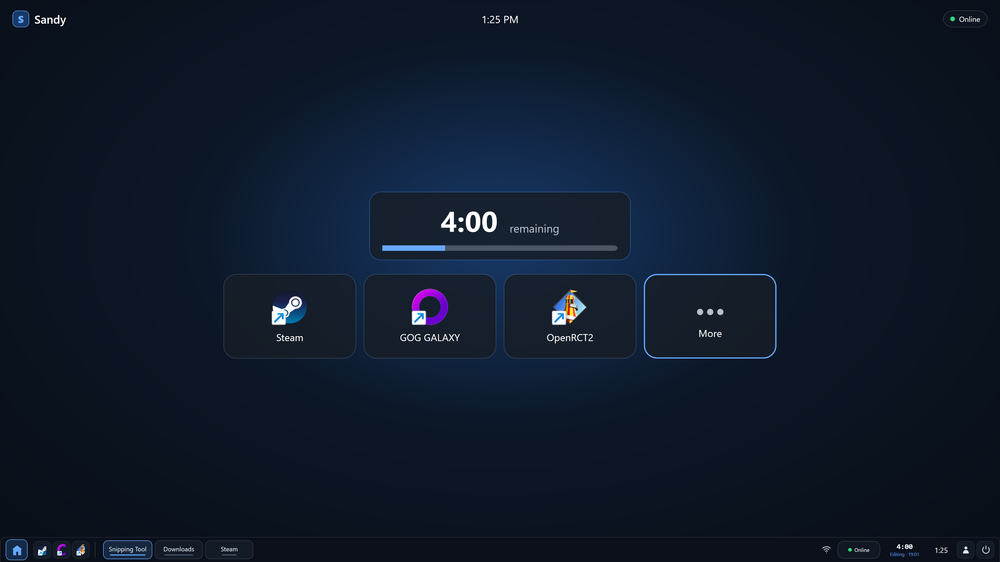

# Sandy

Sandy is a family-focused Windows launcher with remotely managed screen time. While time is available, its per-user agent presents a multi-monitor home screen for pinned apps, a live countdown, and a Sandy taskbar for switching between open windows. When time runs out, Sandy replaces the launcher with a full-screen expired-session overlay.

A Rails PWA lets parents grant or revoke time and temporarily unlock launcher editing. The server owns the authoritative deadline, while the Windows agent keeps counting through short network outages and returns to the normal launcher as soon as more time is available. Explorer remains the Windows shell, and parents can temporarily expose the regular desktop during an editing session.

> **AI disclaimer:** Generative AI was used extensively in the development of this project. Most of the code has not been reviewed for correctness, safety, or security.



This is a visibility and consistency tool, not hardened parental-control software. A technically determined local user, elevated applications, and the Windows secure desktop are outside its threat model. `Ctrl`+`Alt`+`Delete` intentionally remains an escape hatch.

## Repository

- [`server/`](server/) — Rails 8.1 control plane, parent PWA/Hotwire interface, JSON API, and Action Cable endpoint.
- [`agent/`](agent/) — .NET 10 WPF launcher, taskbar, enforcement UI, and platform-independent timer/synchronization core.
- [`ios/`](ios/) — Hotwire Native iPhone and iPad parent app.
- [`deploy/`](deploy/) — homelab Docker Compose deployment.
- [Architecture and ADR index](docs/architecture.md#architecture-decision-records) — boundaries, domain model, and recorded design decisions.
- [`docs/protocol.md`](docs/protocol.md) — device HTTP/WebSocket synchronization contract.
- [`docs/deployment.md`](docs/deployment.md) — initial installation and upgrades.
- [`docs/backup-and-recovery.md`](docs/backup-and-recovery.md) — SQLite-volume backup and recovery.
- [`docs/windows-acceptance.md`](docs/windows-acceptance.md) — real-Windows release checklist.
- [`docs/future-enhancements.md`](docs/future-enhancements.md) — future enhancements and TODOs.

## Development

The Rails app requires the Ruby version recorded in `server/.ruby-version` and SQLite:

```sh
cd server
bin/setup
bin/rails test
```

To launch an isolated local demo with showcase data and an already-enrolled mock agent:

```sh
cd server
bin/demo
```

Open `http://127.0.0.1:3000` and sign in with `demo@sandy.test` / `password`. These credentials are intentionally insecure and must only be used for the local demo. Override them with `SANDY_DEMO_EMAIL` and `SANDY_DEMO_PASSWORD`. Each run replaces `server/storage/demo.sqlite3` without changing the normal development database. Set `PORT` to use another port, for example `PORT=3100 bin/demo`.

The Windows timer core can be developed and tested on macOS. Building or exercising WPF requires Windows:

```sh
dotnet restore agent/Sandy.slnx
dotnet test agent/Sandy.slnx -c Release
```

See [`docs/deployment.md`](docs/deployment.md) for production configuration. Never commit `server/config/master.key`, `deploy/.env`, a join code, or a device token.
